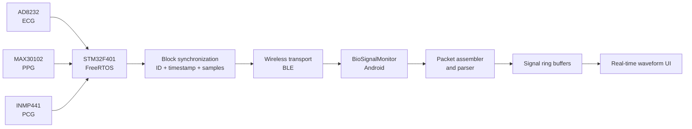
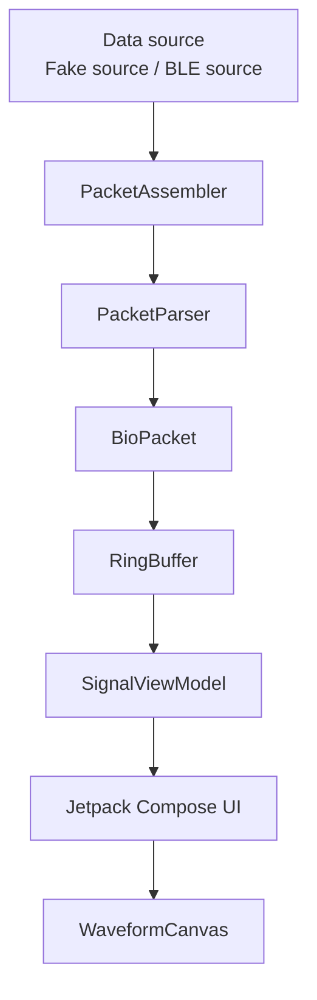

# BioSignalMonitor

[](https://developer.android.com/)
[](https://kotlinlang.org/)
[](https://developer.android.com/compose)
[](#project-status)

**BioSignalMonitor** is an Android application for receiving, parsing, buffering, and visualizing synchronized biomedical signals, including:

- **ECG** — Electrocardiogram
- **PPG** — Photoplethysmogram
- **PCG** — Phonocardiogram

The application is part of a larger embedded biomedical monitoring system in which an STM32-based acquisition device collects synchronized ECG, PPG, and PCG samples and sends data to Android through a wireless communication layer.

> This repository currently focuses on the Android-side data pipeline, packet processing, signal buffering, and waveform visualization. Hardware BLE integration is under active development.

---

## Table of Contents

- [Overview](#overview)
- [Project Status](#project-status)
- [System Context](#system-context)
- [Application Architecture](#application-architecture)
- [Data Flow](#data-flow)
- [Implemented Features](#implemented-features)
- [Planned Features](#planned-features)
- [Project Structure](#project-structure)
- [Technology Stack](#technology-stack)
- [Getting Started](#getting-started)
- [Build and Run](#build-and-run)
- [Testing](#testing)
- [Packet Processing](#packet-processing)
- [Engineering Considerations](#engineering-considerations)
- [Git Workflow](#git-workflow)
- [Security and Privacy](#security-and-privacy)
- [Known Limitations](#known-limitations)
- [Roadmap](#roadmap)
- [Contributing](#contributing)
- [Author](#author)
- [License](#license)

---

## Overview

The purpose of BioSignalMonitor is to provide a reliable Android interface for real-time biomedical signal monitoring.

The application is designed around several core responsibilities:

1. Receive raw data from a communication source.
2. Assemble fragmented data into complete packets.
3. Validate and parse packet contents.
4. Store incoming samples in bounded buffers.
5. Update the application state through a ViewModel.
6. Render ECG, PPG, and PCG waveforms on the Android UI.
7. Detect malformed packets, missing blocks, and sequence discontinuities.

The design separates packet transport, protocol parsing, signal storage, and UI rendering so that each component can be tested and maintained independently.

---

## Project Status

**Current phase:** Android data pipeline prototype

### Available

- Android project initialized with Kotlin.
- Jetpack Compose user interface.
- Biomedical packet data model.
- Packet assembler.
- Packet parser.
- Ring buffer implementation.
- Fake BLE/data source for development and testing.
- Custom waveform drawing component.
- Initial state-management layer.

### In progress

- Android BLE scanning and connection.
- GATT service and characteristic discovery.
- Notification-based packet reception.
- Automatic BLE reconnection.
- Continuous rendering of synchronized ECG, PPG, and PCG signals.
- Packet-loss and sequence-gap monitoring.

### Not yet completed

- End-to-end BLE integration with the physical embedded device.
- Long-duration stability testing.
- CSV recording and export.
- Medical-grade signal validation.
- Production release configuration.

---

## System Context

BioSignalMonitor is intended to communicate with an embedded acquisition system containing:

- **STM32F401**
- **AD8232** for ECG acquisition
- **MAX30102** for PPG acquisition
- **INMP441** for PCG acquisition
- **FreeRTOS / CMSIS-OS**
- DMA-based acquisition
- Timer-based synchronization
- Block-based signal transfer

The embedded system groups samples into synchronized blocks. Each synchronized block is expected to contain corresponding ECG, PPG, and PCG data associated with the same sequence identifier and timestamp.



---

## Application Architecture

The Android application follows a layered structure:



### Main layers

| Layer | Responsibility |
|---|---|
| Data source | Produces incoming byte streams from a fake source or BLE connection |
| Packet assembly | Combines fragmented byte chunks into complete frames |
| Packet parsing | Converts validated frames into structured signal packets |
| Signal storage | Maintains bounded sample history using ring buffers |
| State management | Exposes signal state to the UI |
| Presentation | Draws waveforms and displays connection or packet status |

This separation reduces coupling and makes it easier to replace the fake data source with a real BLE implementation later.

---

## Data Flow

A typical data block follows this path:

```text
Embedded sensors
    ↓
STM32 synchronized block
    ↓
BLE packet or packet fragment
    ↓
PacketAssembler
    ↓
PacketParser
    ↓
BioPacket
    ↓
ECG / PPG / PCG ring buffers
    ↓
SignalViewModel
    ↓
WaveformCanvas
```

The intended packet-level checks include:

- Frame completeness
- Expected packet size
- Supported packet type or format
- Valid sample count
- Sequence continuity
- Timestamp progression
- Protection against malformed or truncated data

---

## Implemented Features

### Protocol and data handling

- Structured `BioPacket` data model
- Packet assembly from partial byte streams
- Packet parsing into signal arrays
- Separation between transport logic and protocol logic
- Test data generation through `FakeBleSource`

### Signal processing infrastructure

- Fixed-capacity ring buffer
- Continuous insertion of incoming samples
- Controlled memory usage
- Foundation for multi-channel synchronized buffering

### User interface

- Jetpack Compose-based application
- Custom waveform rendering with `WaveformCanvas`
- Theme support
- Architecture prepared for real-time updates

### Testing foundation

- Unit-test source set
- Instrumented-test source set
- Fake input source for deterministic protocol testing

---

## Planned Features

- BLE permission handling for supported Android versions
- BLE scanning and device filtering
- GATT connection management
- Service and characteristic discovery
- Characteristic notification subscription
- MTU negotiation
- Packet fragmentation and reassembly over BLE
- Sequence-gap detection
- Packet-loss statistics
- Automatic reconnect with retry and timeout policy
- ECG, PPG, and PCG display controls
- Pause, resume, and clear actions
- Adjustable waveform scale
- Recording session management
- CSV export
- Session metadata
- Long-duration memory and performance tests
- Background operation strategy
- Error and diagnostic logging

---

## Project Structure

```text
BioSignalMonitor/
├── app/
│   ├── build.gradle.kts
│   └── src/
│       ├── androidTest/
│       │   └── java/com/example/biosignalmonitor/
│       │       └── ExampleInstrumentedTest.kt
│       ├── main/
│       │   ├── AndroidManifest.xml
│       │   ├── java/com/example/biosignalmonitor/
│       │   │   ├── MainActivity.kt
│       │   │   ├── WaveformCanvas.kt
│       │   │   ├── fake/
│       │   │   │   └── FakeBleSource.kt
│       │   │   ├── protocol/
│       │   │   │   ├── BioPacket.kt
│       │   │   │   ├── PacketAssembler.kt
│       │   │   │   └── PacketParser.kt
│       │   │   ├── signal/
│       │   │   │   ├── RingBuffer.kt
│       │   │   │   └── SignalViewModel.kt
│       │   │   └── ui/theme/
│       │   │       ├── Color.kt
│       │   │       ├── Theme.kt
│       │   │       └── Type.kt
│       │   └── res/
│       └── test/
│           └── java/com/example/biosignalmonitor/
│               └── ExampleUnitTest.kt
├── gradle/
├── build.gradle.kts
├── gradle.properties
├── settings.gradle.kts
├── gradlew
├── gradlew.bat
└── README.md
```

---

## Technology Stack

| Category | Technology |
|---|---|
| Language | Kotlin |
| Platform | Android |
| UI | Jetpack Compose |
| Build system | Gradle with Kotlin DSL |
| State management | Android ViewModel architecture |
| Graphics | Custom Compose Canvas drawing |
| Data transport | BLE planned; fake source currently available |
| Version control | Git and GitHub |
| Testing | JUnit and Android instrumented tests |

---

## Getting Started

### Prerequisites

Install the following tools:

- Android Studio
- Android SDK
- Git
- JDK supported by the configured Android Gradle Plugin
- Android device or emulator

For physical BLE testing, an Android device with Bluetooth Low Energy support is required.

### Clone the repository

Using SSH:

```bash
git clone git@github.com:khanhnguyendang224440/BioSignalMonitor.git
```

Or using HTTPS:

```bash
git clone https://github.com/khanhnguyendang224440/BioSignalMonitor.git
```

Open the cloned folder in Android Studio.

### Gradle synchronization

After opening the project:

1. Wait for Android Studio to complete Gradle synchronization.
2. Install any requested SDK components.
3. Select an emulator or connected Android device.
4. Build and run the application.

---

## Build and Run

### Windows PowerShell

```powershell
.\gradlew.bat assembleDebug
```

### macOS or Linux

```bash
./gradlew assembleDebug
```

### Install the debug application

```powershell
.\gradlew.bat installDebug
```

### Run from Android Studio

1. Open the project.
2. Select the `app` run configuration.
3. Select a target device.
4. Press **Run**.

---

## Testing

### Run local unit tests

Windows:

```powershell
.\gradlew.bat test
```

macOS or Linux:

```bash
./gradlew test
```

### Run connected Android tests

Windows:

```powershell
.\gradlew.bat connectedAndroidTest
```

macOS or Linux:

```bash
./gradlew connectedAndroidTest
```

### Recommended protocol test cases

The packet-processing layer should be tested with:

- One complete valid packet
- A packet split into multiple fragments
- Multiple packets in one received byte array
- Invalid header
- Invalid packet length
- Incomplete packet
- Unexpected sample count
- Duplicate sequence number
- Missing sequence number
- Sequence number rollover
- Timestamp discontinuity
- Noise bytes before a valid packet
- Continuous reception over a long period

---

## Packet Processing

The protocol layer currently contains:

- `BioPacket.kt` — structured representation of a decoded signal block
- `PacketAssembler.kt` — reconstructs complete frames from incoming chunks
- `PacketParser.kt` — validates and decodes a complete frame

A decoded packet is expected to represent synchronized biomedical samples and associated metadata such as:

- Sequence identifier
- Timestamp
- Number of samples
- ECG samples
- PPG samples
- PCG samples

The exact byte-level frame specification should remain synchronized with the firmware implementation.

When the embedded packet format changes, update all of the following together:

1. STM32 or bridge-device packet serializer
2. Android `PacketParser`
3. Packet-size validation
4. Unit tests
5. Protocol documentation

### Recommended protocol documentation format

| Field | Size | Type | Description |
|---|---:|---|---|
| Header | Project-defined | Unsigned | Frame start marker |
| Sequence | Project-defined | Unsigned | Monotonic block identifier |
| Timestamp | Project-defined | Unsigned | Acquisition timestamp |
| Sample count | Project-defined | Unsigned | Samples per signal block |
| ECG payload | Project-defined | Signed samples | ECG block |
| PPG payload | Project-defined | Unsigned or signed samples | PPG block |
| PCG payload | Project-defined | Signed samples | PCG block |
| Integrity field | Optional | CRC/checksum | Transmission validation |

> Replace the project-defined sizes with the final firmware protocol specification once the BLE frame format is frozen.

---

## Engineering Considerations

### Bounded memory usage

Biomedical monitoring can run continuously for long periods. Unbounded lists may continuously grow and eventually cause excessive memory usage.

The project uses a fixed-capacity ring buffer so that:

- Memory usage remains predictable.
- Old samples can be overwritten safely.
- The waveform can display a fixed time window.
- Long-running monitoring is less likely to fail because of memory growth.

### Packet fragmentation

BLE notifications may not always align with one complete application packet. A complete frame may arrive through:

- One notification
- Several notifications
- A notification containing the end of one frame and the beginning of another

For that reason, packet assembly is handled separately from packet parsing.

### UI performance

The waveform layer should avoid unnecessary recomposition and allocation.

Recommended practices include:

- Keep signal buffers bounded.
- Avoid copying large arrays on every sample.
- Update the UI in batches rather than for every individual sample.
- Separate acquisition frequency from display refresh rate.
- Use background coroutines for packet handling.
- Keep BLE callbacks short and non-blocking.

### Synchronization

The Android application should not assume that signals are synchronized merely because they arrive together.

Synchronization should be verified through packet metadata:

- Same block sequence
- Same timestamp
- Expected sample count
- Valid ordering
- No missing blocks

### Error handling

Production behavior should account for:

- Bluetooth disabled
- Missing permissions
- Device out of range
- GATT connection failure
- Service discovery failure
- Notification setup failure
- Invalid packet
- Packet timeout
- Sequence gap
- Unexpected disconnection
- Reconnection exhaustion

---

## Git Workflow

The project uses `main` as the stable branch.

New work should be developed on dedicated branches.

### Branch naming

```text
feature/ble-scanning
feature/gatt-connection
feature/realtime-waveform
feature/csv-export
fix/packet-fragmentation
fix/sequence-gap
refactor/protocol-layer
test/packet-parser
docs/update-readme
```

### Typical workflow

```bash
git switch main
git pull origin main
git switch -c feature/ble-scanning

# Make changes

git status
git add .
git commit -m "feat: implement BLE device scanning"
git push -u origin feature/ble-scanning
```

Create a pull request from the feature branch into `main`, review the changes, and merge only after the project builds successfully.

### Commit convention

This project follows a Conventional Commits-style format:

```text
feat: add a new feature
fix: correct a defect
refactor: restructure code without changing behavior
test: add or update tests
docs: update documentation
chore: update tooling or project configuration
perf: improve performance
```

Examples:

```text
feat: add BLE packet notification handler
fix: preserve incomplete bytes between notifications
test: add fragmented packet parser tests
refactor: separate protocol parsing from BLE transport
docs: document synchronized signal packet format
```

---

## Security and Privacy

Biomedical signals may be sensitive personal data.

Before using this application with real users:

- Do not commit API keys, passwords, certificates, or signing keys.
- Do not store personal health data without explicit consent.
- Avoid writing raw biomedical data to public logs.
- Use secure transport where applicable.
- Define a data-retention policy.
- Protect exported files.
- Review Android backup behavior.
- Review device permissions.
- Follow applicable privacy and medical-data regulations.

Files such as the following must not be committed:

```text
local.properties
*.jks
*.keystore
*.p12
*.pem
.env
secrets.properties
```

This project is intended for engineering development and academic research. It is **not a certified medical device** and must not be used as the sole basis for diagnosis or treatment.

---

## Known Limitations

- BLE hardware integration is not yet complete.
- Current development relies partly on a fake data source.
- Packet protocol documentation is not yet frozen.
- Signal rendering has not yet been validated for long-duration sessions.
- No persistent recording workflow is currently available.
- No clinical validation has been performed.
- No release build or distribution workflow has been configured.

---

## Roadmap

### Phase 1 — Protocol pipeline

- [x] Create packet data model
- [x] Implement packet assembler
- [x] Implement packet parser
- [x] Implement bounded ring buffer
- [x] Add fake data source
- [x] Add initial waveform component

### Phase 2 — BLE integration

- [ ] Add runtime Bluetooth permissions
- [ ] Scan for target device
- [ ] Filter by device name or service UUID
- [ ] Connect to GATT server
- [ ] Discover services and characteristics
- [ ] Enable notifications
- [ ] Receive fragmented packets
- [ ] Add automatic reconnect

### Phase 3 — Real-time monitoring

- [ ] Display ECG waveform
- [ ] Display PPG waveform
- [ ] Display PCG waveform
- [ ] Show connection state
- [ ] Show packet rate
- [ ] Show sequence gaps
- [ ] Add pause and clear controls

### Phase 4 — Recording and analysis

- [ ] Start and stop recording sessions
- [ ] Export CSV
- [ ] Save session metadata
- [ ] Add basic filtering options
- [ ] Add signal-quality indicators
- [ ] Validate sample continuity

### Phase 5 — Reliability

- [ ] Long-duration test
- [ ] Memory profiling
- [ ] CPU profiling
- [ ] Reconnection stress test
- [ ] Invalid-packet fuzz testing
- [ ] Background and lifecycle testing
- [ ] Release build configuration

---

## Contributing

This repository is currently maintained as an academic and engineering project.

For proposed changes:

1. Create a dedicated branch.
2. Keep each commit focused.
3. Add tests for protocol changes.
4. Update documentation when behavior changes.
5. Confirm that the project builds before opening a pull request.
6. Do not commit local configuration or sensitive information.

---

## Author

**Nguyễn Đăng Khánh**

- GitHub: [@khanhnguyendang224440](https://github.com/khanhnguyendang224440)
- Focus: Embedded Systems, IoT, Android, BLE, and biomedical signal acquisition

---

## License

No license has been selected yet.

Until a license is added, the source code remains under the default copyright restrictions. Others may view the repository, but reuse, modification, and redistribution are not automatically granted.

A license such as MIT, Apache-2.0, or another suitable license can be added later depending on the intended use of the project.

---

## Vietnamese Summary

BioSignalMonitor là ứng dụng Android dùng để tiếp nhận, phân tích, lưu đệm và hiển thị ba tín hiệu y sinh đồng bộ:

- ECG — điện tâm đồ
- PPG — quang thể tích ký
- PCG — âm tim

Ứng dụng là một phần của hệ thống thu thập tín hiệu dùng STM32, FreeRTOS và các cảm biến AD8232, MAX30102, INMP441.

Hiện tại repository đã có nền tảng xử lý packet, ring buffer, nguồn dữ liệu giả và giao diện vẽ waveform. Phần BLE thật, ghi dữ liệu và kiểm thử dài hạn đang tiếp tục được phát triển.
