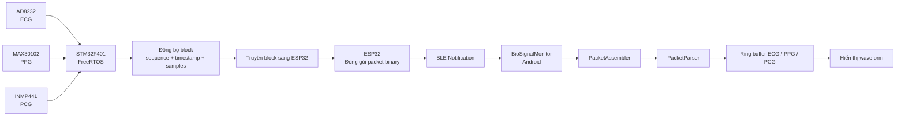
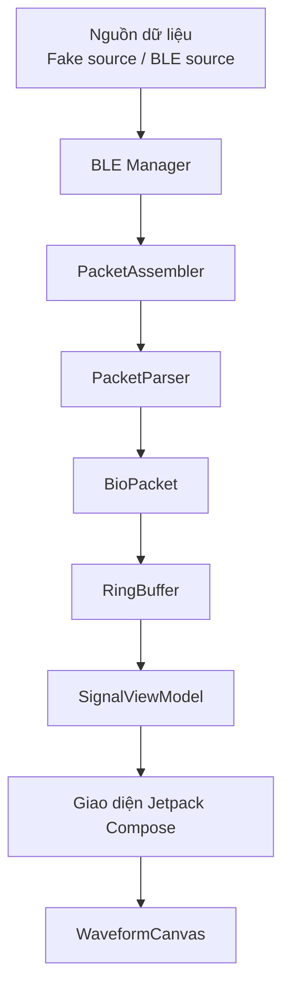

# BioSignalMonitor

[](https://developer.android.com/)
[](https://kotlinlang.org/)
[](https://developer.android.com/compose)
[](#trạng-thái-dự-án)

**BioSignalMonitor** là ứng dụng Android mã nguồn mở dùng để tiếp nhận, hiển thị và giám sát các tín hiệu sinh học ECG, PPG và PCG được đồng bộ từ hệ thống nhúng STM32.

- **ECG** — Điện tâm đồ
- **PPG** — Quang thể tích ký
- **PCG** — Âm tâm đồ

Ứng dụng là một phần của hệ thống giám sát tín hiệu y sinh gồm STM32, ESP32 và thiết bị Android.

Trong hệ thống:

- **STM32F401** thu thập và đồng bộ dữ liệu ECG, PPG và PCG.
- **ESP32** nhận block dữ liệu từ STM32, đóng gói thành packet binary và truyền dữ liệu qua Bluetooth Low Energy.
- **Ứng dụng Android** nhận dữ liệu BLE, ghép packet, phân tích dữ liệu và hiển thị waveform.

> Repository hiện tập trung vào phía Android, bao gồm nhận dữ liệu binary, ghép packet, phân tích packet, lưu mẫu bằng ring buffer và hiển thị waveform. Phần kết nối BLE với ESP32 thật đang được tiếp tục phát triển.

---

## Giới thiệu

Mục tiêu của BioSignalMonitor là xây dựng một ứng dụng Android có khả năng giám sát tín hiệu y sinh theo thời gian thực một cách ổn định, dễ mở rộng và dễ kiểm thử.

Ứng dụng được thiết kế để thực hiện các nhiệm vụ chính:

1. Kết nối với ESP32 thông qua Bluetooth Low Energy.
2. Nhận các mảnh dữ liệu binary từ BLE notification.
3. Ghép các mảnh dữ liệu thành packet hoàn chỉnh.
4. Kiểm tra và phân tích nội dung packet.
5. Chuyển packet thành dữ liệu ECG, PPG và PCG.
6. Lưu mẫu tín hiệu vào bộ đệm có giới hạn.
7. Cập nhật trạng thái ứng dụng thông qua ViewModel.
8. Hiển thị waveform ECG, PPG và PCG.
9. Phát hiện packet lỗi, mất block hoặc gián đoạn sequence.

Việc tách riêng tầng truyền dữ liệu, tầng giao thức, tầng lưu trữ và tầng giao diện giúp hệ thống dễ bảo trì, dễ kiểm thử và dễ thay thế nguồn dữ liệu giả bằng kết nối BLE thật.

---

## Trạng thái dự án

Các thành phần hiện đã được xây dựng:

- Project Android sử dụng Kotlin.
- Giao diện Jetpack Compose.
- Mô hình dữ liệu `BioPacket`.
- Bộ ghép packet `PacketAssembler`.
- Bộ phân tích packet `PacketParser`.
- Ring buffer để lưu tín hiệu.
- Nguồn dữ liệu giả phục vụ kiểm thử.
- Thành phần vẽ waveform tùy chỉnh.
- Tầng quản lý trạng thái ban đầu.
- Kiểm thử packet binary bằng dữ liệu giả.
- Kiểm tra khả năng chuyển dữ liệu binary thành `BioPacket`.

---

## Bối cảnh hệ thống

BioSignalMonitor được thiết kế để hoạt động trong hệ thống thu thập và giám sát tín hiệu y sinh gồm ba tầng chính:

1. Tầng thu thập và đồng bộ dữ liệu bằng STM32.
2. Tầng truyền dữ liệu không dây bằng ESP32.
3. Tầng giám sát và hiển thị bằng ứng dụng Android.

### Tầng thu thập tín hiệu STM32

Hệ thống STM32 gồm:

- **STM32F401**
- **AD8232** dùng để thu tín hiệu ECG
- **MAX30102** dùng để thu tín hiệu PPG
- **INMP441** dùng để thu tín hiệu PCG
- **FreeRTOS / CMSIS-OS**
- ADC và DMA cho ECG
- I2C cho PPG
- I2S và DMA cho PCG
- Timer dùng để tạo mốc lấy mẫu và đồng bộ
- Queue, Mail hoặc Semaphore dùng để trao đổi dữ liệu giữa các task

STM32 chịu trách nhiệm:

- Thu thập tín hiệu từ ba cảm biến.
- Gom dữ liệu thành từng block.
- Đồng bộ ECG, PPG và PCG.
- Gán `sequence`, `timestamp` và `sample_count`.
- Chuyển block dữ liệu đồng bộ sang ESP32.

Mỗi block dữ liệu dự kiến chứa:

- `sequence`
- `timestamp`
- `sample_count`
- Mảng mẫu ECG
- Mảng mẫu PPG
- Mảng mẫu PCG

### Tầng truyền dữ liệu ESP32

ESP32 đóng vai trò cầu nối giữa STM32 và ứng dụng Android.

ESP32 chịu trách nhiệm:

- Nhận block tín hiệu đồng bộ từ STM32.
- Kiểm tra kích thước dữ liệu đầu vào.
- Đóng gói block thành packet binary.
- Chia packet thành nhiều phần nếu packet lớn hơn kích thước BLE notification.
- Truyền packet binary đến Android thông qua BLE.
- Duy trì trạng thái kết nối với ứng dụng.
- Có thể bổ sung checksum hoặc CRC để kiểm tra toàn vẹn dữ liệu.

ESP32 không trực tiếp thực hiện việc hiển thị hoặc phân tích waveform. Nhiệm vụ chính của ESP32 là truyền dữ liệu binary từ STM32 đến Android một cách ổn định.

### Tầng ứng dụng Android

Ứng dụng Android chịu trách nhiệm:

- Quét thiết bị ESP32.
- Kết nối ESP32 qua BLE.
- Khám phá service và characteristic.
- Đăng ký nhận BLE notification.
- Nhận các mảnh dữ liệu binary.
- Ghép dữ liệu thành packet hoàn chỉnh.
- Phân tích packet thành `BioPacket`.
- Đưa dữ liệu vào ring buffer.
- Cập nhật ViewModel.
- Hiển thị ECG, PPG và PCG theo thời gian thực.
- Phát hiện packet lỗi hoặc packet bị mất.



---

## Kiến trúc ứng dụng

Ứng dụng Android được tổ chức theo các tầng độc lập:



### Vai trò của từng tầng

| Tầng | Chức năng |
|---|---|
| Nguồn dữ liệu | Cung cấp dữ liệu giả hoặc dữ liệu nhận từ ESP32 |
| BLE Manager | Quét, kết nối và nhận notification từ ESP32 |
| Ghép packet | Ghép nhiều đoạn byte thành một frame hoàn chỉnh |
| Phân tích packet | Kiểm tra và chuyển frame thành dữ liệu tín hiệu |
| Mô hình dữ liệu | Lưu nội dung packet dưới dạng `BioPacket` |
| Lưu tín hiệu | Lưu lịch sử mẫu trong ring buffer có giới hạn |
| Quản lý trạng thái | Cung cấp dữ liệu và trạng thái cho giao diện |
| Hiển thị | Vẽ waveform và hiển thị trạng thái kết nối |

Kiến trúc này giúp giảm phụ thuộc giữa các thành phần. Khi thay nguồn dữ liệu giả bằng BLE thật, phần parser, ring buffer và giao diện có thể tiếp tục được sử dụng mà không cần thay đổi lớn.

---

## Chức năng đã thực hiện

### Xử lý dữ liệu và giao thức

- Mô hình dữ liệu `BioPacket`.
- Ghép packet từ nhiều mảnh byte.
- Phân tích packet thành các mảng tín hiệu.
- Tách riêng tầng truyền thông và tầng giao thức.
- Tạo dữ liệu kiểm thử thông qua `FakeBleSource`.
- Kiểm thử khả năng parse packet binary.
- Kiểm tra dữ liệu `sequence`, `timestamp` và `sample_count`.

### Hạ tầng xử lý tín hiệu

- Ring buffer có dung lượng cố định.
- Chèn mẫu liên tục.
- Kiểm soát bộ nhớ.
- Chuẩn bị nền tảng lưu ba kênh tín hiệu đồng bộ.
- Hạn chế tăng bộ nhớ khi ứng dụng chạy lâu.

### Giao diện

- Sử dụng Jetpack Compose.
- Vẽ waveform bằng `WaveformCanvas`.
- Hỗ trợ theme.
- Chuẩn bị kiến trúc cho cập nhật thời gian thực.
- Có thể mở rộng để hiển thị riêng từng tín hiệu.

---

## Công nghệ sử dụng

| Hạng mục | Công nghệ |
|---|---|
| Ngôn ngữ | Kotlin |
| Nền tảng | Android |
| Giao diện | Jetpack Compose |
| Build system | Gradle với Kotlin DSL |
| Quản lý trạng thái | Android ViewModel |
| Vẽ tín hiệu | Compose Canvas |
| Truyền dữ liệu không dây | Bluetooth Low Energy |
| Thiết bị BLE | ESP32 |
| Thiết bị thu thập tín hiệu | STM32F401 |
| Định dạng truyền | Packet binary |
| Quản lý mã nguồn | Git và GitHub |
| Kiểm thử | JUnit và Android Instrumented Test |

---

## Kiểm thử

### Các trường hợp nên kiểm thử cho packet

- Một packet hoàn chỉnh.
- Một packet bị chia thành nhiều BLE notification.
- Nhiều packet trong cùng một mảng byte.
- Một notification chứa cuối packet trước và đầu packet sau.
- Header sai.
- Kích thước packet sai.
- Packet chưa đủ.
- Số mẫu không đúng.
- Sequence bị lặp.
- Sequence bị mất.
- Sequence bị tràn.
- Timestamp không liên tục.
- Có byte rác trước packet hợp lệ.
- Packet bị thay đổi byte.
- Packet sai thứ tự byte.
- ESP32 gửi packet quá nhanh.
- Android nhận packet không liên tục.
- Nhận dữ liệu liên tục trong thời gian dài.
- Mất kết nối BLE giữa chừng.
- Kết nối lại và tiếp tục nhận dữ liệu.

---

## Xử lý packet

Tầng giao thức hiện có:

- `BioPacket.kt` — mô tả dữ liệu của một block tín hiệu.
- `PacketAssembler.kt` — ghép packet từ các đoạn dữ liệu nhận được.
- `PacketParser.kt` — kiểm tra và phân tích packet hoàn chỉnh.

Một packet sau khi phân tích dự kiến chứa:

- Sequence.
- Timestamp.
- Số lượng mẫu.
- Mảng ECG.
- Mảng PPG.
- Mảng PCG.

Định dạng byte của packet Android phải luôn đồng bộ với định dạng packet do ESP32 gửi.

Trong toàn bộ hệ thống:

- STM32 tạo block dữ liệu tín hiệu đồng bộ.
- ESP32 chuyển block thành packet binary BLE.
- Android phân tích packet binary thành `BioPacket`.

Khi thay đổi định dạng packet, cần sửa đồng thời:

1. Cấu trúc block dữ liệu phía STM32.
2. Phần nhận dữ liệu STM32 phía ESP32.
3. Phần đóng gói packet binary phía ESP32.
4. `PacketAssembler` phía Android nếu kích thước hoặc cách phân mảnh thay đổi.
5. `PacketParser` phía Android.
6. Kiểm tra kích thước packet.
7. Unit test.
8. Tài liệu giao thức.

### Cấu trúc packet dự kiến

| Trường | Ý nghĩa |
|---|---|
| Header | Đánh dấu bắt đầu packet |
| Version | Phiên bản giao thức |
| Packet type | Loại packet |
| Sequence | ID block tăng dần |
| Timestamp | Thời điểm thu hoặc tạo block |
| Sample count | Số mẫu của mỗi tín hiệu |
| ECG payload | Mảng mẫu ECG |
| PPG payload | Mảng mẫu PPG |
| PCG payload | Mảng mẫu PCG |
| CRC hoặc checksum | Kiểm tra toàn vẹn packet |

Kích thước cụ thể của từng trường phải được cập nhật theo code firmware ESP32 và `PacketParser`.

---

## Các vấn đề kỹ thuật quan trọng

### Quản lý bộ nhớ

Ứng dụng giám sát y sinh có thể chạy liên tục trong thời gian dài. Nếu dùng danh sách không giới hạn, dữ liệu sẽ tăng dần và có thể làm ứng dụng hết bộ nhớ.

Ring buffer giúp:

- Bộ nhớ luôn có giới hạn.
- Tự động ghi đè mẫu cũ.
- Hiển thị một cửa sổ thời gian cố định.
- Tăng độ ổn định khi chạy lâu.
- Hạn chế việc cấp phát bộ nhớ liên tục.

### Phân mảnh packet BLE

BLE notification không đảm bảo mỗi notification chứa đúng một packet hoàn chỉnh.

Một packet binary có thể:

- Nằm trọn trong một notification.
- Bị chia thành nhiều notification.
- Có phần đầu nằm trong notification trước.
- Có phần cuối nằm trong notification sau.
- Chung notification với một phần của packet tiếp theo.

Do đó, Android cần sử dụng `PacketAssembler` để lưu dữ liệu tạm thời và chỉ gọi `PacketParser` khi đã có đủ một packet hoàn chỉnh.

### MTU và kích thước packet

Kích thước packet binary có thể lớn hơn payload BLE mặc định.

Hệ thống cần:

- Thương lượng MTU nếu cần.
- Không giả định mỗi BLE notification là một packet.
- Có cơ chế đánh dấu đầu packet.
- Có trường độ dài packet.
- Ghép đúng thứ tự các mảnh packet.
- Phát hiện fragment bị thiếu.

### Hiệu năng giao diện

Waveform thời gian thực cần hạn chế cấp phát bộ nhớ và recomposition không cần thiết.

Một số nguyên tắc:

- Dùng buffer có giới hạn.
- Không copy mảng lớn ở mỗi sample.
- Cập nhật UI theo block.
- Tách tần số lấy mẫu và tần số vẽ.
- Xử lý packet trên coroutine nền.
- Callback BLE phải ngắn và không blocking.
- Không thực hiện thao tác nặng trong callback nhận notification.
- Chỉ đưa dữ liệu cần thiết lên giao diện.

### Đồng bộ tín hiệu

Ứng dụng không nên mặc định ba tín hiệu đồng bộ chỉ vì chúng xuất hiện trong cùng packet.

Cần kiểm tra:

- Cùng sequence.
- Cùng timestamp.
- Đủ số mẫu.
- Đúng thứ tự.
- Không mất block.
- Không trùng block.
- `sample_count` khớp với dữ liệu thực tế.

### Kiểm tra mất packet

Android có thể kiểm tra packet bị mất bằng sequence:

```text
expectedSequence = previousSequence + 1
```

Nếu sequence nhận được khác sequence dự kiến, ứng dụng có thể ghi nhận:

- Số packet bị mất.
- Khoảng sequence bị thiếu.
- Thời điểm xảy ra mất packet.
- Tổng tỷ lệ packet loss.

### Xử lý lỗi

Hệ thống thực tế cần xử lý:

- Bluetooth bị tắt.
- Thiếu quyền truy cập.
- ESP32 ngoài phạm vi.
- Không tìm thấy ESP32.
- Kết nối GATT thất bại.
- Khám phá service thất bại.
- Không tìm thấy characteristic.
- Bật notification thất bại.
- MTU negotiation thất bại.
- Packet sai.
- Packet timeout.
- Packet thiếu fragment.
- Mất sequence.
- Mất kết nối bất ngờ.
- ESP32 khởi động lại.
- Kết nối lại thất bại nhiều lần.
- Dữ liệu STM32 và ESP32 không cùng định dạng.

---

## Tác giả

**Nguyễn Đăng Khánh**

- GitHub: [@khanhnguyendang224440](https://github.com/khanhnguyendang224440)
- Lĩnh vực quan tâm: Embedded Systems, IoT, Android, BLE và thu thập tín hiệu y sinh

---

## License

Dự án này là mã nguồn mở và được phát hành theo giấy phép MIT License.

Người dùng có thể sử dụng, chỉnh sửa, phân phối và công bố lại phần mềm này, miễn là giữ lại thông tin bản quyền và nội dung giấy phép gốc.

Xem chi tiết tại file [LICENSE](LICENSE).