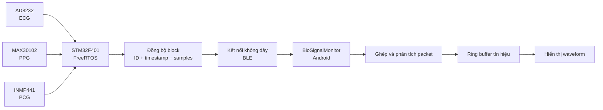
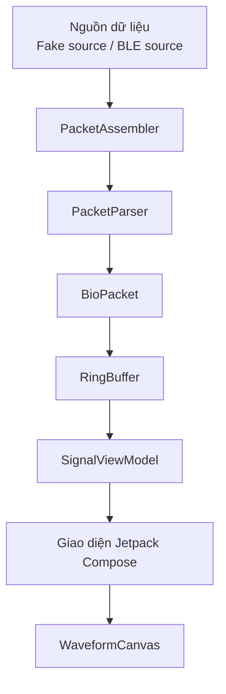

# BioSignalMonitor

[](https://developer.android.com/)
[](https://kotlinlang.org/)
[](https://developer.android.com/compose)
[](#trạng-thái-dự-án)

**BioSignalMonitor** là ứng dụng Android dùng để tiếp nhận, phân tích, lưu đệm và hiển thị theo thời gian thực ba loại tín hiệu y sinh đồng bộ:

- **ECG** — Điện tâm đồ
- **PPG** — Quang thể tích ký
- **PCG** — Âm tâm đồ

Ứng dụng là một phần của hệ thống giám sát tín hiệu y sinh, trong đó thiết bị nhúng sử dụng STM32 để thu thập đồng bộ ECG, PPG và PCG, sau đó truyền dữ liệu đến điện thoại Android qua kết nối không dây.

> Repository hiện tập trung vào phía Android, bao gồm xử lý dữ liệu đầu vào, ghép packet, phân tích packet, lưu mẫu bằng ring buffer và hiển thị waveform. Phần kết nối BLE với thiết bị thật đang được tiếp tục phát triển.

---

## Giới thiệu

Mục tiêu của BioSignalMonitor là xây dựng một ứng dụng Android có khả năng giám sát tín hiệu y sinh theo thời gian thực một cách ổn định, dễ mở rộng và dễ kiểm thử.

Ứng dụng được thiết kế để thực hiện các nhiệm vụ chính:

1. Nhận dữ liệu thô từ nguồn truyền thông.
2. Ghép các mảnh dữ liệu thành packet hoàn chỉnh.
3. Kiểm tra và phân tích nội dung packet.
4. Lưu mẫu tín hiệu vào bộ đệm có giới hạn.
5. Cập nhật trạng thái ứng dụng thông qua ViewModel.
6. Hiển thị waveform ECG, PPG và PCG.
7. Phát hiện packet lỗi, mất block hoặc gián đoạn sequence.

Việc tách riêng tầng truyền dữ liệu, tầng giao thức, tầng lưu trữ và tầng giao diện giúp hệ thống dễ bảo trì, dễ kiểm thử và dễ thay thế nguồn dữ liệu giả bằng BLE thật.

---

## Trạng thái dự án

- Project Android sử dụng Kotlin.
- Giao diện Jetpack Compose.
- Mô hình dữ liệu `BioPacket`.
- Bộ ghép packet `PacketAssembler`.
- Bộ phân tích packet `PacketParser`.
- Ring buffer để lưu tín hiệu.
- Nguồn dữ liệu giả phục vụ kiểm thử.
- Thành phần vẽ waveform tùy chỉnh.
- Tầng quản lý trạng thái ban đầu.

---

## Bối cảnh hệ thống

BioSignalMonitor được thiết kế để làm việc với hệ thống thu thập tín hiệu gồm:

- **STM32F401**
- **AD8232** dùng cho ECG
- **MAX30102** dùng cho PPG
- **INMP441** dùng cho PCG
- **FreeRTOS / CMSIS-OS**
- Thu thập dữ liệu bằng DMA
- Đồng bộ bằng Timer
- Truyền dữ liệu theo block

Thiết bị nhúng gom mẫu thành các block đồng bộ. Mỗi block dự kiến chứa dữ liệu ECG, PPG và PCG có cùng mã sequence và timestamp.



---

## Kiến trúc ứng dụng

Ứng dụng được tổ chức theo các tầng độc lập:



### Vai trò của từng tầng

| Tầng | Chức năng |
|---|---|
| Nguồn dữ liệu | Tạo hoặc tiếp nhận luồng byte từ dữ liệu giả hoặc BLE |
| Ghép packet | Ghép nhiều đoạn byte thành một frame hoàn chỉnh |
| Phân tích packet | Kiểm tra và chuyển frame thành dữ liệu tín hiệu |
| Lưu tín hiệu | Lưu lịch sử mẫu trong ring buffer có giới hạn |
| Quản lý trạng thái | Cung cấp dữ liệu và trạng thái cho giao diện |
| Hiển thị | Vẽ waveform và hiển thị trạng thái kết nối hoặc packet |

Kiến trúc này giúp giảm phụ thuộc giữa các thành phần và cho phép phát triển BLE thật mà không phải sửa toàn bộ phần giao diện.

---

## Luồng dữ liệu

Một block dữ liệu đi qua các bước sau:

```text
Cảm biến y sinh
    ↓
STM32 tạo block đồng bộ
    ↓
BLE packet hoặc mảnh packet
    ↓
PacketAssembler
    ↓
PacketParser
    ↓
BioPacket
    ↓
Ring buffer ECG / PPG / PCG
    ↓
SignalViewModel
    ↓
WaveformCanvas
```

Các kiểm tra dự kiến ở tầng packet:

- Packet đã đủ dữ liệu hay chưa
- Kích thước packet có đúng hay không
- Loại packet có được hỗ trợ hay không
- Số lượng mẫu có hợp lệ hay không
- Sequence có liên tục hay không
- Timestamp có tăng hợp lệ hay không
- Dữ liệu có bị thiếu hoặc hỏng hay không

---

## Chức năng đã thực hiện

### Xử lý dữ liệu và giao thức

- Mô hình dữ liệu `BioPacket`
- Ghép packet từ nhiều mảnh byte
- Phân tích packet thành các mảng tín hiệu
- Tách riêng tầng truyền thông và tầng giao thức
- Tạo dữ liệu kiểm thử thông qua `FakeBleSource`

### Hạ tầng xử lý tín hiệu

- Ring buffer có dung lượng cố định
- Chèn mẫu liên tục
- Kiểm soát bộ nhớ
- Chuẩn bị nền tảng lưu ba kênh tín hiệu đồng bộ

### Giao diện

- Sử dụng Jetpack Compose
- Vẽ waveform bằng `WaveformCanvas`
- Hỗ trợ theme
- Chuẩn bị kiến trúc cho cập nhật thời gian thực

### Kiểm thử

- Có thư mục unit test
- Có thư mục instrumented test
- Có nguồn dữ liệu giả để kiểm thử giao thức độc lập với phần cứng

---

## Chức năng dự kiến

- Xử lý quyền Bluetooth theo từng phiên bản Android
- Quét thiết bị BLE
- Lọc thiết bị theo tên hoặc UUID
- Kết nối GATT
- Khám phá service và characteristic
- Đăng ký nhận notification
- Thương lượng MTU
- Ghép packet bị chia nhỏ qua BLE
- Phát hiện mất sequence
- Thống kê tỷ lệ mất packet
- Tự động kết nối lại với retry và timeout
- Điều khiển hiển thị từng tín hiệu
- Tạm dừng, tiếp tục và xóa biểu đồ
- Điều chỉnh tỉ lệ waveform
- Quản lý phiên ghi dữ liệu
- Xuất CSV
- Lưu metadata của phiên đo
- Kiểm thử bộ nhớ và hiệu năng dài hạn
- Xử lý vòng đời ứng dụng
- Ghi log lỗi và chẩn đoán

---

## Công nghệ sử dụng

| Hạng mục | Công nghệ |
|---|---|
| Ngôn ngữ | Kotlin |
| Nền tảng | Android |
| Giao diện | Jetpack Compose |
| Build system | Gradle với Kotlin DSL |
| Quản lý trạng thái | Android ViewModel |
| Vẽ tín hiệu | Compose Canvas |
| Truyền dữ liệu | Dự kiến BLE, hiện có nguồn giả |
| Quản lý mã nguồn | Git và GitHub |
| Kiểm thử | JUnit và Android Instrumented Test |

---

## Cài đặt dự án

### Yêu cầu

Cần cài đặt:

- Android Studio
- Android SDK
- Git
- JDK tương thích với Android Gradle Plugin
- Thiết bị Android hoặc emulator

Để kiểm thử BLE thật, thiết bị Android cần hỗ trợ Bluetooth Low Energy.

---

## Kiểm thử

### Các trường hợp nên kiểm thử cho packet

- Một packet hoàn chỉnh
- Một packet bị chia thành nhiều mảnh
- Nhiều packet trong cùng một mảng byte
- Header sai
- Kích thước packet sai
- Packet chưa đủ
- Số mẫu không đúng
- Sequence bị lặp
- Sequence bị mất
- Sequence bị tràn
- Timestamp không liên tục
- Có byte rác trước packet hợp lệ
- Nhận dữ liệu liên tục trong thời gian dài

---

## Xử lý packet

Tầng giao thức hiện có:

- `BioPacket.kt` — mô tả dữ liệu của một block tín hiệu
- `PacketAssembler.kt` — ghép packet từ các đoạn dữ liệu nhận được
- `PacketParser.kt` — kiểm tra và phân tích packet hoàn chỉnh

Một packet sau khi phân tích dự kiến chứa:

- Sequence
- Timestamp
- Số lượng mẫu
- Mảng ECG
- Mảng PPG
- Mảng PCG

Định dạng byte của packet Android phải luôn đồng bộ với firmware.

Khi thay đổi định dạng packet, cần sửa đồng thời:

1. Phần đóng gói packet phía STM32 hoặc ESP32
2. `PacketParser` phía Android
3. Kiểm tra kích thước packet
4. Unit test
5. Tài liệu giao thức

---

## Các vấn đề kỹ thuật quan trọng

### Quản lý bộ nhớ

Ứng dụng giám sát y sinh có thể chạy liên tục trong thời gian dài. Nếu dùng danh sách không giới hạn, dữ liệu sẽ tăng dần và có thể làm ứng dụng hết bộ nhớ.

Ring buffer giúp:

- Bộ nhớ luôn có giới hạn
- Tự động ghi đè mẫu cũ
- Hiển thị một cửa sổ thời gian cố định
- Tăng độ ổn định khi chạy lâu

### Hiệu năng giao diện

Waveform thời gian thực cần hạn chế cấp phát bộ nhớ và recomposition không cần thiết.

Một số nguyên tắc:

- Dùng buffer có giới hạn
- Không copy mảng lớn ở mỗi sample
- Cập nhật UI theo batch
- Tách tần số lấy mẫu và tần số vẽ
- Xử lý packet trên coroutine nền
- Callback BLE phải ngắn và không blocking

### Đồng bộ tín hiệu

Ứng dụng không nên mặc định ba tín hiệu đồng bộ chỉ vì chúng xuất hiện trong cùng packet.

Cần kiểm tra:

- Cùng sequence
- Cùng timestamp
- Đủ số mẫu
- Đúng thứ tự
- Không mất block

### Xử lý lỗi

Hệ thống thực tế cần xử lý:

- Bluetooth bị tắt
- Thiếu quyền truy cập
- Thiết bị ngoài phạm vi
- Kết nối GATT thất bại
- Khám phá service thất bại
- Bật notification thất bại
- Packet sai
- Packet timeout
- Mất sequence
- Mất kết nối bất ngờ
- Kết nối lại thất bại nhiều lần

---

## Tác giả

**Nguyễn Đăng Khánh**

- GitHub: [@khanhnguyendang224440](https://github.com/khanhnguyendang224440)
- Lĩnh vực quan tâm: Embedded Systems, IoT, Android, BLE và thu thập tín hiệu y sinh